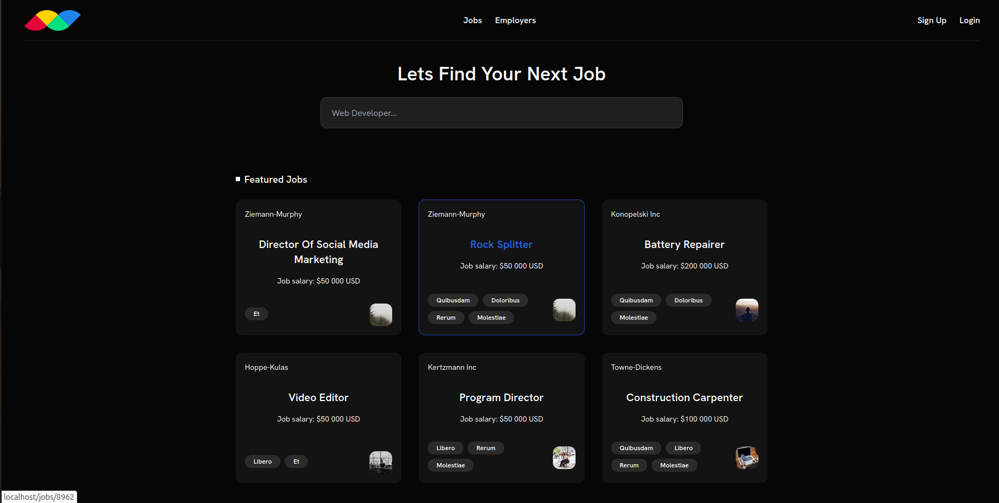
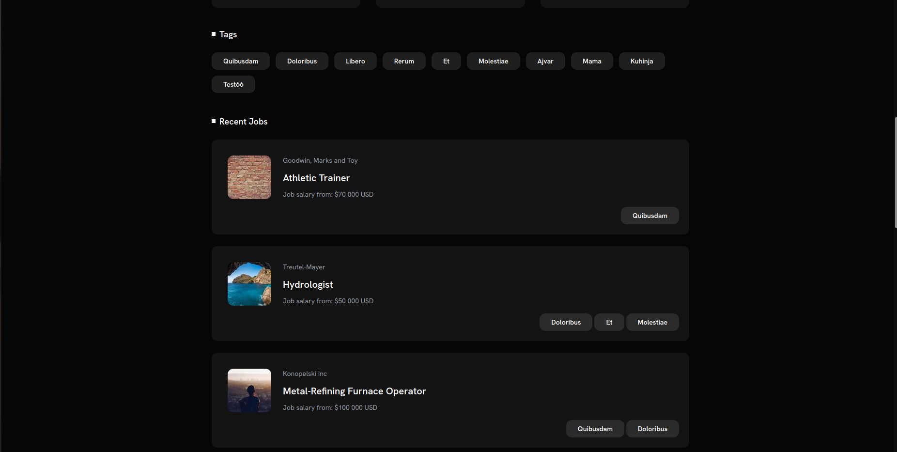
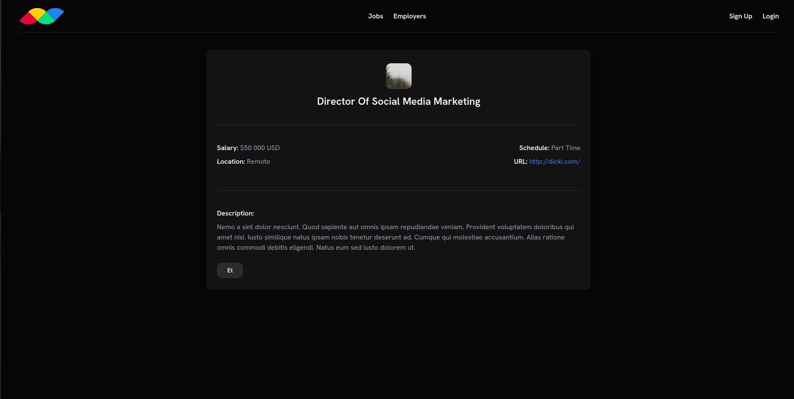
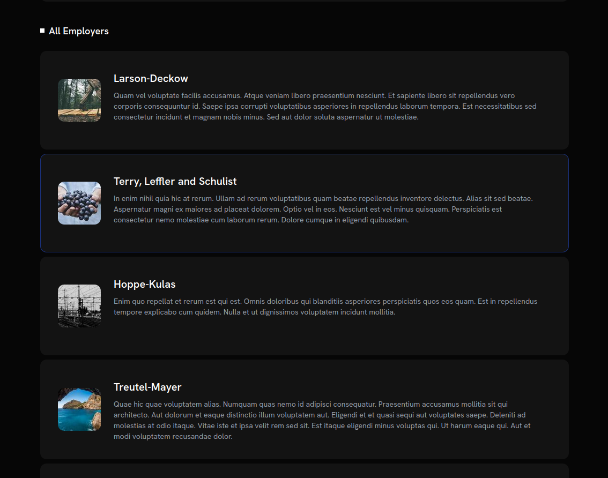
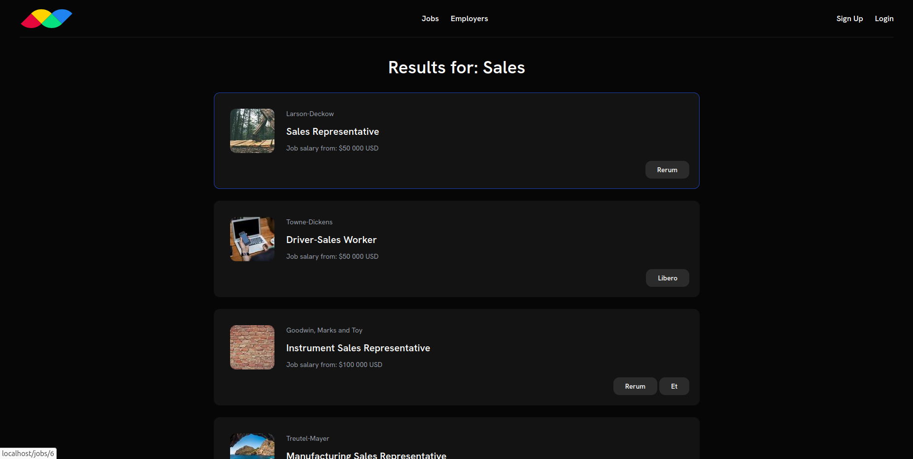
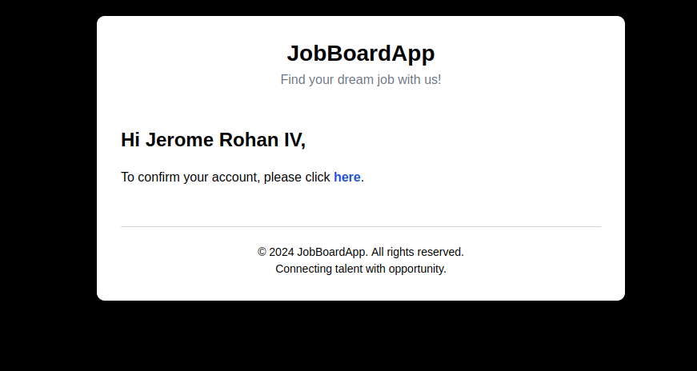

# JobBoardApp

JobBoardApp is a job listing web application built with Laravel. It allows employers to post job listings and visitor(guests) to browse and apply for jobs. 
The project uses a LEMP (Linux, Nginx, MySQL, PHP) stack and is fully dockerized for ease of deployment and development.

## Features
- Integration with Docker for containerized development.
- User(Employer) authentication (register, login, logout) and authorization.
- Job listing management (CRUD operations for jobs).
- Job and Employer listing with pagination
- Performant Employer, Job, Tags search
- User (Employer) management (with associated job listings).
- User (Employer) Email validation
- Responsive design with Tailwind CSS.

## Technologies Used
- Backend: Laravel 11 (PHP Framework)
- Frontend: Tailwind CSS, Blade Templates
- Database: MySQL (via MariaDB in Docker)
- Containerization: Docker and Docker Compose
- Web Server: Nginx
- Unit Testing: PestPHP

## Requirements
- Docker & Docker Compose

## Project Structure

- ```/src```: Laravel project files (controllers, models, views, etc.)
- ```/dockerfiles```: Contains Docker-related configurations (Nginx, MySQL, PHP-FPM)
- ```/src/public```: Public assets (CSS, JavaScript, images)

## Environment Variables

Make sure to configure the following environment variables in your .env file:
```bash
MYSQL_DATABASE=mysql_maria_db
MYSQL_USER=my_app_user
MYSQL_PASSWORD=my_app_secret
MYSQL_ROOT_PASSWORD=my_app_root
REDIS_PASSWORD=redis_password
```
## Preview

Here are some screenshots of the app:

### Homepage



### View Job Details


### View All Employees


### Search for Sales


### Mail validate email address



## Setup and Installation

### Step 1: Clone the repository

```bash
git clone https://github.com/milic178/laravel-job-board
cd laravel-job-board 
```

### Step 2: Configure environment variables

cp .env.example .env
```bash
cp .env.example .env
```
Update the .env file with your database credentials, application URL, etc.

### Step 3: Build and start the Docker containers
Run the following command to build and start the containers:
```bash
docker-compose up -d --build app
```
This will set up the LEMP stack (Nginx, MySQL, PHP). 
Bringing up the Docker Compose network with ```app ``` instead of just using ```up ```, ensures that only our site's containers are brought up at the start. Containers with exposed ports detailed:
```
    nginx - :80
    mysql - :3306
    php - :9000
    redis - :6379
    mailhog - :8025
```
Three additional containers are included that handle **Composer, NPM, and Artisan** commands without having to have these platforms installed on your local computer.
``` 
    docker-compose run --rm composer update
    docker-compose run --rm npm run dev
    docker-compose run --rm artisan migrate
```
This configuration allows you to compile assets using both Laravel Mix and Vite. To get started, you need to append `--host 0.0.0.0` to the end of your relevant development command in the `package.json` file. For instance, in a Laravel project that utilizes Vite, you should see:
``` 
"scripts": {
"dev": "vite --host 0.0.0.0",
"build": "vite build"
},
``` 
Then, run the following commands to install your dependencies and start the dev server:

    docker-compose run --rm npm install
    docker-compose run --rm --service-ports npm run dev

### MailHog
The service is integrated into the `docker-compose.yml` file and starts up alongside the web server and database services.

To access the dashboard and view any emails being processed by the system, navigate to `localhost:8025` after executing `docker-compose up -d site`.

### Step 4: Run migrations

Run the Laravel migrations to set up the database schema:
```  docker-compose exec app php artisan migrate ```
### Step 5: Compile frontend assets
``` docker-compose exec app npm run dev ```

## License

This project is open-source and available under the MIT License.